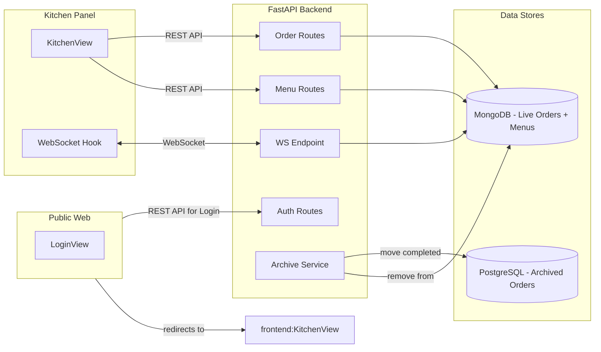
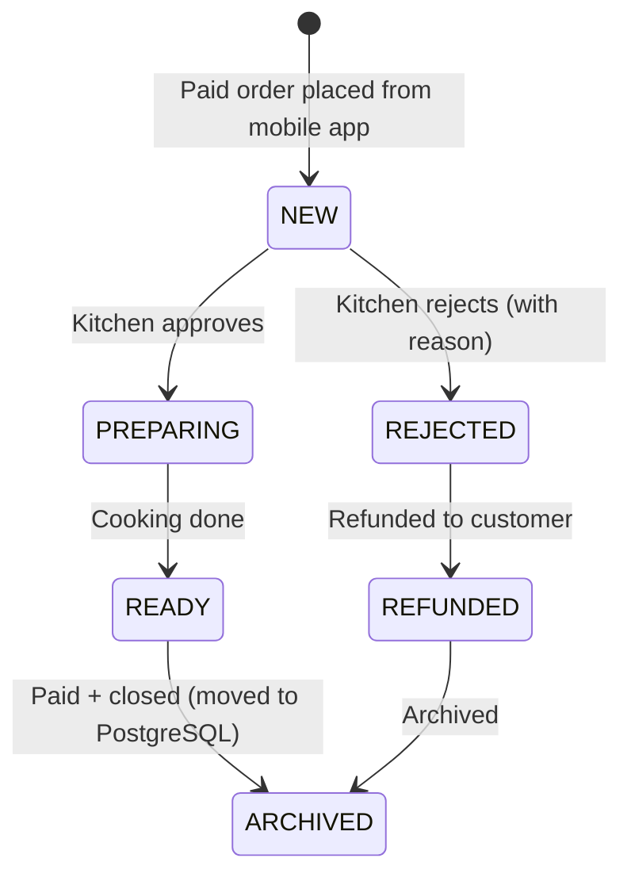

---

name: Kitchen Panel Integration
overview: Remove mocks from kitchen panel, integrate with MongoDB for live orders, add approve/reject flow with Polish i18n, replace 6-digit login with email/password, add menu item availability toggle, implement WebSocket real-time updates, and archive completed orders to PostgreSQL.
todos:

- id: shared-types
content: "Update @restorio/types: add REJECTED status, rejectionReason field, WebSocket event types, is_available to menu items"
status: pending
- id: backend-order-service
content: Create MongoDB-backed OrderService with list/get/create/updateStatus/archive operations
status: pending
- id: backend-order-routes
content: Rewrite order routes to use MongoDB OrderService with proper auth, DTOs, and status transition validation
status: pending
- id: backend-rejection-config
content: Add default Polish rejection labels (i18n) + per-restaurant configurable labels in MongoDBa
status: pending
- id: backend-menu-availability
content: Add is_available field to menu items and PATCH endpoint for toggling availability
status: pending
- id: backend-websocket
content: Create WebSocket endpoint and ConnectionManager for real-time kitchen order events
status: pending
- id: backend-archive
content: Create PostgreSQL archived_orders table (Alembic migration) + archive endpoint that moves completed orders from MongoDB to PG
status: pending
- id: api-client-updates
content: Update OrdersResource (rejection_reason param) and MenusResource (toggleItemAvailability) in @restorio/api-client
status: pending
- id: kitchen-login-replace
content: Replace 6-digit code login with email/password form, update AuthGuard strategy, fix routing
status: pending
- id: kitchen-i18n
content: Wire up pl.json locale in AppProviders, replace ALL hardcoded strings with t() calls, add new translation keys
status: pending
- id: kitchen-remove-mocks
content: Delete mocks/orders.ts, replace useTenantRestaurants mock with API call, rewrite useOrdersState with TanStack Query
status: pending
- id: kitchen-approve-reject
content: Add approve/reject buttons on NEW orders, build rejection modal with quick-select Polish labels
status: pending
- id: kitchen-rejected-column
content: Add REJECTED status column to order board with error styling
status: pending
- id: kitchen-websocket-hook
content: Create useKitchenWebSocket hook with auto-reconnect and query cache integration
status: pending
- id: kitchen-menu-toggle
content: Add Menu navigation tab and item availability toggle view in kitchen panel
status: pending
- id: kitchen-refund-flow
content: Add refund flow to kitchen panel
status: pending
- id api-refund-flow
content: Add refund flow to api (payments service for now facade will suffice as payment developer is busy for now) & api-client
status: pending
isProject: false

---

# Kitchen Panel Full Integration Plan

## Architecture Overview




## Order Lifecycle




---

## 1. Shared Types Updates (`@restorio/types`)

**File:** [app/packages/types/src/order.ts](app/packages/types/src/order.ts)

- Add `REJECTED = "rejected"` to `OrderStatus` enum
- Add `rejectionReason?: string` to `Order` interface
- Add `rejectionLabels?: string[]` to a new `RestaurantKitchenConfig` interface (for per-restaurant configurable labels)
- Add WebSocket message types:

```typescript
interface KitchenOrderEvent {
  type: "order_created" | "order_updated" | "order_archived";
  order: Order;
}
```

**File:** [app/packages/types/src/menu.ts](app/packages/types/src/menu.ts)

- Note: The patch file transforms this file. We need to add `isAvailable?: boolean` (default `true`) to `TenantMenuItem` after the patch is applied.

---

## 2. Backend - MongoDB Live Orders Service

### 2a. Order Service (`app/api/services/order_service.py` - new)

A new service encapsulating all MongoDB order operations on a `kitchen_orders` collection:

- `list_orders(tenant_id, restaurant_id, filters)` - query by status, restaurant
- `get_order(tenant_id, order_id)`
- `create_order(tenant_id, data)` - inserts with status `NEW`
- `update_status(tenant_id, order_id, status, rejection_reason?)` - validates transitions (NEW->PREPARING, NEW->REJECTED, PREPARING->READY)
- `archive_order(tenant_id, order_id)` - moves from MongoDB to PostgreSQL `archived_orders` table

### 2b. Rewrite Order Routes (`app/api/routes/v1/orders.py`)

Current routes are stubs. Rewrite to use MongoDB via `OrderService`:

- `GET /restaurants/{restaurant_id}/orders` - list live orders (matches existing `api-client` pattern)
- `GET /restaurants/{restaurant_id}/orders/{order_id}` - get single order
- `POST /restaurants/{restaurant_id}/orders` - create order
- `PATCH /restaurants/{restaurant_id}/orders/{order_id}/status` - update status (approve/reject/ready)
- Add `AuthorizedTenantId` + `MongoDB` dependencies
- Add role guard: kitchen staff needs `VIEW_ORDERS` / `MANAGE_ORDERS`

### 2c. Order DTOs Update (`app/api/core/dto/v1/orders/`)

Update DTOs to match MongoDB document shape:

- `UpdateOrderStatusDTO`: `status`, `rejection_reason` (optional, required when status is REJECTED)
- `OrderResponseDTO`: match the `Order` type from `@restorio/types`

### 2d. Rejection Labels Config

- Default labels stored as constants in the service:
  - `"Brak skladnikow"` (no ingredients)
  - `"Kuchnia zamknieta"` (kitchen closed)
  - `"Zbyt duze obciazenie"` (too much load)
  - `"Pozycja niedostepna"` (item unavailable)
  - `"Inne"` (other)
- Per-restaurant configurable labels stored in MongoDB `restaurant_kitchen_config` collection
- Endpoint: `GET /restaurants/{restaurant_id}/kitchen-config` returns config including rejection labels

---

## 3. Backend - Menu Item Availability Toggle

**File:** Menu routes from the patch (`app/api/routes/v1/tenants/menu.py`)

- Add `PATCH /{tenant_public_id}/menu/items/{item_name}/availability` endpoint
- Toggles `is_available` field on the menu item in MongoDB
- Add `is_available` field (default `true`) to `MenuItemInputDTO` and `MenuItemDTO`

**File:** [app/packages/api-client/src/resources/menus.ts](app/packages/api-client/src/resources/menus.ts)

- Add `toggleItemAvailability(tenantId, categoryOrder, itemName, isAvailable)` method

---

## 4. Backend - WebSocket for Real-time Updates

**File:** `app/api/routes/v1/ws.py` (new)

- FastAPI WebSocket endpoint: `WS /ws/kitchen/{restaurant_id}`
- Authenticated via token query param (JWT)
- On order create/update/archive, broadcast event to all connected kitchen clients for that restaurant
- Use in-memory pub/sub (asyncio) for single-instance; Redis pub/sub compatible for future scaling
- Message format: `KitchenOrderEvent` JSON

**File:** `app/api/services/ws_manager.py` (new)

- `ConnectionManager` class managing WebSocket connections per restaurant
- `broadcast(restaurant_id, event)` method

---

## 5. Backend - Order Archiving to PostgreSQL

### 5a. Alembic Migration (new)

Create `archived_orders` and `archived_order_items` tables in PostgreSQL:

- `archived_orders`: `id`, `original_order_id`, `tenant_id`, `restaurant_id`, `table_id`, `status`, `rejection_reason`, `total`, `subtotal`, `tax`, `currency`, `notes`, `items_snapshot` (JSONB), `created_at`, `completed_at`, `archived_at`
- Indexed by `tenant_id`, `restaurant_id`, `archived_at` for analytics queries

### 5b. Archive Endpoint

- `POST /restaurants/{restaurant_id}/orders/{order_id}/archive`
- Only works when order status is READY and payment is completed
- Copies full order data (including items as JSONB snapshot) from MongoDB to PostgreSQL
- Removes from MongoDB `kitchen_orders` collection
- Broadcasts `order_archived` WebSocket event

---

## 6. Kitchen Panel - Replace Login

### 6a. Remove 6-digit code login

- Delete [app/apps/kitchen-panel/src/views/LoginView.tsx](app/apps/kitchen-panel/src/views/LoginView.tsx)
- Create new `LoginView.tsx` modeled after public-web's `LoginContent.tsx` but using `@restorio/ui` components (Form, FormField, Input, Button)
- Uses `api.auth.login(email, password)` from the existing `api` client
- Polish-only labels from `pl.json`

### 6b. Update AuthGuard strategy

- In [app/apps/kitchen-panel/src/App.tsx](app/apps/kitchen-panel/src/App.tsx): remove `strategy="code"`, use default strategy
- AuthGuard default behavior already checks cookies + `api.auth.me()` + `api.auth.refresh()` -- this aligns with the public-web flow
- Update `onUnauthorized` in [app/apps/kitchen-panel/src/api/client.ts](app/apps/kitchen-panel/src/api/client.ts) to redirect to the public-web login URL (cross-app auth) OR keep a local login form

### 6c. Update routing

- Remove hardcoded `/demo-tenant` redirects
- After login, resolve tenant from JWT payload (user's `tenant_ids`)

---

## 7. Kitchen Panel - i18n (Polish Only)

### 7a. Wire up Polish locale

- In [app/apps/kitchen-panel/src/wrappers/AppProviders.tsx](app/apps/kitchen-panel/src/wrappers/AppProviders.tsx): change from `locale="en"` + `EMPTY_MESSAGES` to `locale="pl"` + loaded Polish messages
- Import and pass `pl.json` messages

### 7b. Update `pl.json` with new keys

- In [app/apps/kitchen-panel/src/locales/pl.json](app/apps/kitchen-panel/src/locales/pl.json): add keys for:
  - Login: `auth.title`, `auth.email`, `auth.password`, `auth.signIn`, `auth.errors.`*
  - Orders: approve/reject actions, rejection modal, rejection labels
  - Menu: availability toggle
  - Status: add `orders.status.rejected`
  - WebSocket: connection status indicators

### 7c. Replace all hardcoded strings

Replace hardcoded English strings in these files with `t()` calls:

- [app/apps/kitchen-panel/src/views/KitchenView/KitchenView.tsx](app/apps/kitchen-panel/src/views/KitchenView/KitchenView.tsx) - "Kitchen Orders", "Active restaurant:", "All View", "Sliding", "Items", "Notes:", etc.
- [app/apps/kitchen-panel/src/config/orderStatuses.ts](app/apps/kitchen-panel/src/config/orderStatuses.ts) - "New", "Preparing", "Ready"
- [app/apps/kitchen-panel/src/components/KitchenRail.tsx](app/apps/kitchen-panel/src/components/KitchenRail.tsx) - "Orders"

---

## 8. Kitchen Panel - Remove Mocks & Integrate API

### 8a. Delete mock files

- Delete [app/apps/kitchen-panel/src/mocks/orders.ts](app/apps/kitchen-panel/src/mocks/orders.ts)
- Remove mock restaurant data from [app/apps/kitchen-panel/src/features/restaurants/hooks/useTenantRestaurants.ts](app/apps/kitchen-panel/src/features/restaurants/hooks/useTenantRestaurants.ts) -- use `api.restaurants.list()` instead

### 8b. Rewrite `useOrdersState` hook

- In [app/apps/kitchen-panel/src/features/orders/hooks/useOrdersState.ts](app/apps/kitchen-panel/src/features/orders/hooks/useOrdersState.ts):
  - Replace local state with TanStack Query (`useQuery` for listing, `useMutation` for status updates)
  - `useQuery({ queryKey: ["orders", restaurantId], queryFn: () => api.orders.list(restaurantId) })`
  - `useMutation` for `api.orders.updateStatus(restaurantId, orderId, status)`
  - Optimistic updates for drag-and-drop responsiveness

### 8c. Add approve/reject actions to OrderCard

- Add "Zatwierdz" (Approve) and "Odrzuc" (Reject) buttons on NEW orders
- Approve: calls `updateStatus(restaurantId, orderId, "preparing")`
- Reject: opens a modal with prepopulated Polish quick-labels as selectable chips/buttons
- Reject modal: select reason -> confirm -> calls `updateStatus(restaurantId, orderId, "rejected", { rejectionReason })`

### 8d. Add `REJECTED` status column

- Update [app/apps/kitchen-panel/src/config/orderStatuses.ts](app/apps/kitchen-panel/src/config/orderStatuses.ts) to include REJECTED status with appropriate styling (error/red indicator)

---

## 9. Kitchen Panel - WebSocket Integration

- New hook: `useKitchenWebSocket(restaurantId)` in `features/orders/hooks/`
- Connects to `WS /ws/kitchen/{restaurantId}`
- On `order_created`: invalidate/update query cache
- On `order_updated`: update specific order in cache
- On `order_archived`: remove from cache
- Auto-reconnect with exponential backoff
- Connection status indicator in the UI header

---

## 10. Kitchen Panel - Menu Item Availability Toggle

- New view/tab: "Menu" in `KitchenRail` navigation
- Lists all menu categories and items from `api.menus.get(tenantId)`
- Each item has a toggle switch for `isAvailable`
- Toggle calls `api.menus.toggleItemAvailability(...)`
- Visual distinction for unavailable items (greyed out, strikethrough)

---

## Key Files Summary


| Area                 | Key Files                                                         |
| -------------------- | ----------------------------------------------------------------- |
| **Types**            | `app/packages/types/src/order.ts`, `menu.ts`                      |
| **API Client**       | `app/packages/api-client/src/resources/orders.ts`, `menus.ts`     |
| **Backend Routes**   | `app/api/routes/v1/orders.py` (rewrite), `ws.py` (new)            |
| **Backend Services** | `app/api/services/order_service.py` (new), `ws_manager.py` (new)  |
| **Kitchen Panel**    | `src/views/LoginView.tsx`, `KitchenView.tsx`, `useOrdersState.ts` |
| **i18n**             | `src/locales/pl.json`                                             |
| **Migration**        | `app/api/alembic/versions/` (new migration)                       |


