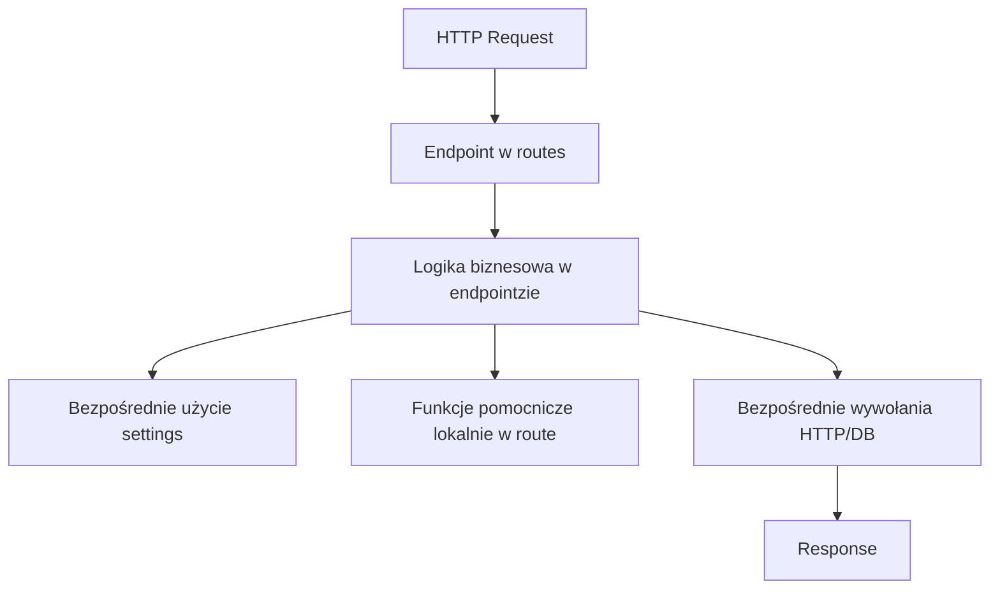
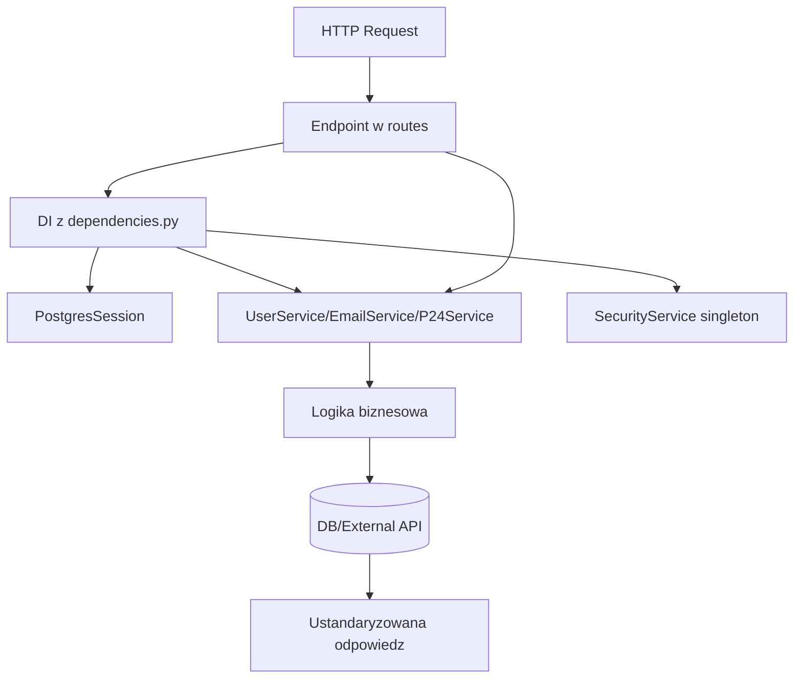

# Tworzenie endpointu i przekazywanie zależności

## 1. Jak wygląda tworzenie endpointu
Wzorzec w routerach (`routes/v1/...`) jest teraz spójny:

1. Endpoint przyjmuje `request` DTO (np. `RegisterDTO`, `CreatePaymentRequest`).
2. Endpoint przyjmuje `session: PostgresSession` z DI.
3. Endpoint przyjmuje serwisy przez aliasy DI (np. `UserServiceDep`, `EmailServiceDep`, `P24ServiceDep`).
4. Logika biznesowa jest wykonywana w serwisie.
5. Endpoint zwraca ustandaryzowaną odpowiedź (`SuccessResponse`, `CreatedResponse`, `UpdatedResponse`).

Przykłady:
- `app/api/routes/v1/auth.py`
- `app/api/routes/v1/payments/create_payment.py`
- `app/api/routes/v1/payments/update_p24_config.py`

## 2. Dependency Injection (DI)
Centralny punkt DI to:
- `app/api/core/foundation/dependencies.py`

Masz tam:
- funkcje providerów (`get_user_service`, `get_email_service`, `get_p24_service`, `get_security_service`, `get_db_session`),
- aliasy `Annotated[..., Depends(...)]`, np.:
  - `UserServiceDep`
  - `EmailServiceDep`
  - `P24ServiceDep`
  - `PostgresSession`

Dzięki temu w endpointach typ zależności jest czytelny i nie trzeba za każdym razem pisać pełnego `Depends(...)`.

## 3. Singleton
W obecnym flow singletonem jest `SecurityService`:
- `app/api/core/foundation/security.py`

Instancja globalna:
- `security_service = SecurityService()`

I później provider:
- `get_security_service()` zwraca tę samą instancję.

To daje jeden współdzielony obiekt do operacji security (JWT/hash/verify), a inne serwisy (np. `AuthService`, `UserService`) dostają go przez DI.

## 4. Repositories
Warstwa repozytoriów jest przygotowywana:
- `app/api/core/repositories/tenant_repository.py`

`TenantRepository` ma już kontrakt metod (`find_by_id`, `find_all`, `save`, `create`, `update`, `delete`), ale implementacja jest jeszcze pusta (`pass`).

Czyli aktualnie większość logiki dostępu do danych nadal jest w serwisach (`TenantService`, `EmailService`, `AuthService`) przez `AsyncSession`, a kolejnym krokiem może być stopniowe przeniesienie zapytań do repozytoriów.

## 5. Settings
Konfiguracja jest centralna:
- `app/api/core/foundation/infra/config.py`

`settings = Settings()` jest jednym punktem dostępu do ENV i domyślnych wartości.

W Twoim flow:
- endpointy używają `settings` do URL-i frontendu / API (`FRONTEND_URL`, `PRZELEWY24_API_URL`),
- serwisy trzymają config lokalnie w `__init__` (np. `EmailService`, `P24Service`, `SecurityService`), żeby nie czytać ENV w wielu miejscach logiki.

To upraszcza testowanie i utrzymuje spójny kierunek: `endpoint -> DI -> service -> (docelowo) repository`.

## 6. Mermaid: stare vs aktualne podejście

### Stare podejście (bardziej „spięte” i trudniejsze w testach)

Dlaczego to było słabsze:
- endpoint mieszał orkiestrację z logiką domenową,
- trudniejsze mockowanie i testowanie (dużo rzeczy „na sztywno” w route),
- większe ryzyko duplikacji kodu między endpointami.

### Aktualne podejście (DI + serwisy + singleton security)

Dlaczego to jest lepsze:
- endpoint jest cienki i czytelny (głównie wejście/wyjście),
- logika jest w serwisach, więc łatwiej ją testować jednostkowo,
- zależności są jawne i spójne dzięki `Annotated + Depends`,
- `SecurityService` jako singleton daje jeden punkt konfiguracji JWT/hash.
