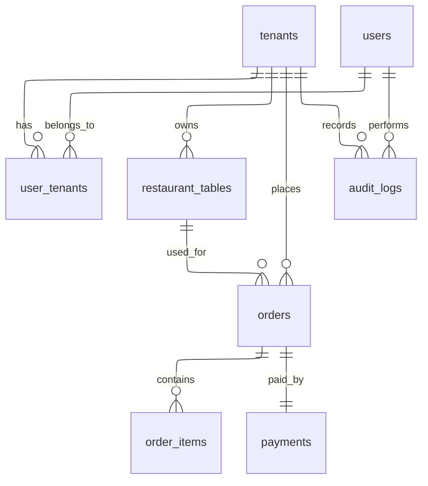

# PostgreSQL Core Schema Documentation

## Overview

This document describes the **PostgreSQL core schema** for the Restorio multi-tenant restaurant management platform. PostgreSQL serves as the **system of record** for transactional, relational, and auditable data.

## Implementation Layers

The PostgreSQL implementation uses a **three-layer architecture**:

1. **SQL Migrations** (`migrations/001_initial_schema.sql`): Raw SQL for schema definition and DDL operations
2. **ORM Models** (`core/models.py`): SQLAlchemy 2.0 models for application code and DML operations
3. **DTOs** (`core/postgres_models.py`): Pydantic models for API request/response validation

This separation follows the design principle: **DTO → Domain Logic → ORM Model → Database**

## Architecture Principles

### Polyglot Persistence

- **PostgreSQL**: Strongly relational data, financial correctness, access control, auditability, reporting
- **MongoDB**: Order drafts, live sessions, UI interaction, evolving document-oriented data

### Multi-tenancy Strategy

**Shared database, tenant isolation via `tenant_id`**

- Every business table includes `tenant_id`
- Simpler operations and backups
- Academically recommended for SaaS MVPs
- Aligns with modular monolith architecture

## Entity Relationship Diagram



## Table Definitions

### tenants

Core tenant (restaurant/client) entity.

| Column     | Type                     | Constraints                | Description                                 |
| ---------- | ------------------------ | -------------------------- | ------------------------------------------- |
| id         | UUID                     | PRIMARY KEY                | Unique identifier                           |
| name       | VARCHAR(255)             | NOT NULL                   | Tenant display name                         |
| slug       | VARCHAR(100)             | NOT NULL, UNIQUE           | URL-friendly identifier                     |
| status     | tenant_status            | NOT NULL, DEFAULT 'ACTIVE' | Tenant status (ACTIVE, SUSPENDED, INACTIVE) |
| created_at | TIMESTAMP WITH TIME ZONE | NOT NULL, DEFAULT NOW()    | Creation timestamp                          |

**Indexes:**

- Primary key on `id`
- Unique index on `slug`

### users

System users (can belong to multiple tenants).

| Column        | Type                     | Constraints             | Description           |
| ------------- | ------------------------ | ----------------------- | --------------------- |
| id            | UUID                     | PRIMARY KEY             | Unique identifier     |
| email         | VARCHAR(255)             | NOT NULL, UNIQUE        | User email address    |
| password_hash | VARCHAR(255)             | NOT NULL                | Bcrypt password hash  |
| is_active     | BOOLEAN                  | NOT NULL, DEFAULT TRUE  | Account active status |
| created_at    | TIMESTAMP WITH TIME ZONE | NOT NULL, DEFAULT NOW() | Creation timestamp    |

**Indexes:**

- Primary key on `id`
- Unique index on `email`

### user_tenants

Junction table for many-to-many relationship between users and tenants, with role assignment.

| Column     | Type                     | Constraints                 | Description             |
| ---------- | ------------------------ | --------------------------- | ----------------------- |
| user_id    | UUID                     | NOT NULL, FK -> users(id)   | User reference          |
| tenant_id  | UUID                     | NOT NULL, FK -> tenants(id) | Tenant reference        |
| role       | VARCHAR(50)              | NOT NULL                    | User role within tenant |
| created_at | TIMESTAMP WITH TIME ZONE | NOT NULL, DEFAULT NOW()     | Assignment timestamp    |

**Indexes:**

- Composite primary key on `(user_id, tenant_id)`
- Index on `user_id`
- Index on `tenant_id`

### restaurant_tables

Physical restaurant tables managed by tenants.

| Column     | Type                     | Constraints                 | Description                   |
| ---------- | ------------------------ | --------------------------- | ----------------------------- |
| id         | UUID                     | PRIMARY KEY                 | Unique identifier             |
| tenant_id  | UUID                     | NOT NULL, FK -> tenants(id) | Tenant owner                  |
| label      | VARCHAR(50)              | NOT NULL                    | Table label (e.g., "Table 1") |
| capacity   | INTEGER                  | NOT NULL, CHECK > 0         | Maximum seating capacity      |
| is_active  | BOOLEAN                  | NOT NULL, DEFAULT TRUE      | Table active status           |
| created_at | TIMESTAMP WITH TIME ZONE | NOT NULL, DEFAULT NOW()     | Creation timestamp            |

**Indexes:**

- Primary key on `id`
- Unique constraint on `(tenant_id, label)`
- Index on `tenant_id`

### orders

**Finalized orders only** (immutable after creation). Draft orders remain in MongoDB.

| Column       | Type                     | Constraints                           | Description                            |
| ------------ | ------------------------ | ------------------------------------- | -------------------------------------- |
| id           | UUID                     | PRIMARY KEY                           | Unique identifier                      |
| tenant_id    | UUID                     | NOT NULL, FK -> tenants(id)           | Tenant owner                           |
| table_id     | UUID                     | NOT NULL, FK -> restaurant_tables(id) | Table reference                        |
| status       | order_status             | NOT NULL, DEFAULT 'PLACED'            | Order status (PLACED, PAID, CANCELLED) |
| total_amount | DECIMAL(10, 2)           | NOT NULL, CHECK >= 0                  | Total order amount                     |
| currency     | VARCHAR(3)               | NOT NULL, DEFAULT 'PLN'               | Currency code (ISO 4217)               |
| created_at   | TIMESTAMP WITH TIME ZONE | NOT NULL, DEFAULT NOW()               | Creation timestamp                     |
| updated_at   | TIMESTAMP WITH TIME ZONE | NOT NULL, DEFAULT NOW()               | Last update timestamp                  |

**Indexes:**

- Primary key on `id`
- Composite index on `(tenant_id, created_at DESC)` for tenant queries
- Index on `table_id`
- Index on `status`

**Triggers:**

- Auto-update `updated_at` on row update

### order_items

Line items for finalized orders. Includes `name_snapshot` for historical correctness.

| Column        | Type                     | Constraints                | Description                            |
| ------------- | ------------------------ | -------------------------- | -------------------------------------- |
| id            | UUID                     | PRIMARY KEY                | Unique identifier                      |
| order_id      | UUID                     | NOT NULL, FK -> orders(id) | Parent order                           |
| product_id    | VARCHAR(255)             | NOT NULL                   | Product identifier (from MongoDB menu) |
| name_snapshot | VARCHAR(255)             | NOT NULL                   | Product name at time of order          |
| quantity      | INTEGER                  | NOT NULL, CHECK > 0        | Item quantity                          |
| unit_price    | DECIMAL(10, 2)           | NOT NULL, CHECK >= 0       | Price per unit at time of order        |
| created_at    | TIMESTAMP WITH TIME ZONE | NOT NULL, DEFAULT NOW()    | Creation timestamp                     |

**Indexes:**

- Primary key on `id`
- Index on `order_id`

**Note:** `name_snapshot` ensures historical correctness even if menu items change or are deleted.

### payments

Payment records for orders.

| Column             | Type                     | Constraints                 | Description                                           |
| ------------------ | ------------------------ | --------------------------- | ----------------------------------------------------- |
| id                 | UUID                     | PRIMARY KEY                 | Unique identifier                                     |
| order_id           | UUID                     | NOT NULL, FK -> orders(id)  | Associated order                                      |
| provider           | payment_provider         | NOT NULL                    | Payment provider (PRZELEWY24, OTHER, CASH)            |
| status             | payment_status           | NOT NULL, DEFAULT 'PENDING' | Payment status (PENDING, COMPLETED, FAILED, REFUNDED) |
| amount             | DECIMAL(10, 2)           | NOT NULL, CHECK >= 0        | Payment amount                                        |
| external_reference | VARCHAR(255)             | NULL                        | External payment gateway reference                    |
| created_at         | TIMESTAMP WITH TIME ZONE | NOT NULL, DEFAULT NOW()     | Creation timestamp                                    |
| updated_at         | TIMESTAMP WITH TIME ZONE | NOT NULL, DEFAULT NOW()     | Last update timestamp                                 |

**Indexes:**

- Primary key on `id`
- Index on `order_id`
- Index on `status`

**Triggers:**

- Auto-update `updated_at` on row update

### audit_logs

Comprehensive audit trail for tenant actions.

| Column        | Type                     | Constraints                 | Description                                            |
| ------------- | ------------------------ | --------------------------- | ------------------------------------------------------ |
| id            | UUID                     | PRIMARY KEY                 | Unique identifier                                      |
| tenant_id     | UUID                     | NOT NULL, FK -> tenants(id) | Tenant context                                         |
| actor_user_id | UUID                     | NULL, FK -> users(id)       | User who performed action (NULL for system)            |
| action        | VARCHAR(100)             | NOT NULL                    | Action performed (e.g., "CREATE_ORDER", "UPDATE_MENU") |
| entity_type   | VARCHAR(100)             | NOT NULL                    | Entity type (e.g., "order", "menu_item")               |
| entity_id     | UUID                     | NULL                        | Entity identifier                                      |
| metadata      | JSONB                    | NULL                        | Additional context data                                |
| created_at    | TIMESTAMP WITH TIME ZONE | NOT NULL, DEFAULT NOW()     | Action timestamp                                       |

**Indexes:**

- Primary key on `id`
- Composite index on `(tenant_id, created_at DESC)` for tenant queries
- Composite index on `(entity_type, entity_id)` for entity lookups
- Index on `actor_user_id`

## Enum Types

### tenant_status

- `ACTIVE`: Tenant is active and operational
- `SUSPENDED`: Tenant is temporarily suspended
- `INACTIVE`: Tenant is inactive

### order_status

- `PLACED`: Order has been placed
- `PAID`: Order has been paid
- `CANCELLED`: Order has been cancelled

### payment_provider

- `PRZELEWY24`: Przelewy24 payment gateway
- `CASH`: Cash payment

### payment_status

- `PENDING`: Payment is pending
- `COMPLETED`: Payment completed successfully
- `FAILED`: Payment failed
- `REFUNDED`: Payment was refunded

## Order Lifecycle

### MongoDB Responsibility

- Order draft creation
- Live session management
- UI interaction state
- Real-time updates

### PostgreSQL Responsibility

- **Finalized orders only**
- Immutable order records
- Financial correctness
- Audit trail

**Transition:** An order is inserted into PostgreSQL **only once** — when it becomes immutable and billable.

## Constraints & Data Integrity

### Foreign Keys

All foreign key constraints are **enabled** to ensure referential integrity:

- `user_tenants.user_id` → `users.id` (CASCADE on delete)
- `user_tenants.tenant_id` → `tenants.id` (CASCADE on delete)
- `restaurant_tables.tenant_id` → `tenants.id` (CASCADE on delete)
- `orders.tenant_id` → `tenants.id` (CASCADE on delete)
- `orders.table_id` → `restaurant_tables.id` (RESTRICT on delete)
- `order_items.order_id` → `orders.id` (CASCADE on delete)
- `payments.order_id` → `orders.id` (CASCADE on delete)
- `audit_logs.tenant_id` → `tenants.id` (CASCADE on delete)
- `audit_logs.actor_user_id` → `users.id` (SET NULL on delete)

### Check Constraints

- `restaurant_tables.capacity > 0`
- `orders.total_amount >= 0`
- `order_items.quantity > 0`
- `order_items.unit_price >= 0`
- `payments.amount >= 0`

### Soft Deletes

**No soft deletes** for financial tables (`orders`, `order_items`, `payments`) to maintain audit integrity.

## Indexing Strategy

### Performance Indexes

- `users.email`: Unique lookup
- `user_tenants.user_id`: User's tenant memberships
- `user_tenants.tenant_id`: Tenant's users
- `restaurant_tables.tenant_id`: Tenant's tables
- `orders(tenant_id, created_at DESC)`: Tenant order history (most recent first)
- `orders.table_id`: Table order lookup
- `orders.status`: Status filtering
- `order_items.order_id`: Order line items
- `payments.order_id`: Order payments
- `payments.status`: Payment status filtering
- `audit_logs(tenant_id, created_at DESC)`: Tenant audit history
- `audit_logs(entity_type, entity_id)`: Entity audit lookup
- `audit_logs.actor_user_id`: User action history

## Migration

### Running Migrations

```bash
# From the API directory
python -m core.migrations
```

Or programmatically:

```python
from core.migrations import run_all_migrations
import asyncio

asyncio.run(run_all_migrations())
```

### Migration Files

Migrations are stored in `apps/api/migrations/` and executed in alphabetical order.

## Academic Justification

This schema:

1. **Follows relational normalization principles** (3NF)
2. **Ensures data integrity** via foreign keys and constraints
3. **Supports auditing & compliance** via comprehensive audit logs
4. **Cleanly separates** transactional data (PostgreSQL) from operational UI data (MongoDB)
5. **Enables multi-tenancy** via tenant isolation pattern
6. **Maintains financial correctness** via immutable order records

PostgreSQL is intentionally used as the **system of record**, while MongoDB handles evolving, document-oriented domains.

## Future Considerations

- **Reporting & Analytics**: Schema supports efficient aggregation queries
- **Payment Integrations**: Extensible payment provider enum
- **Audit Compliance**: Comprehensive audit trail for regulatory requirements
- **Scalability**: Indexes optimized for tenant-scoped queries
