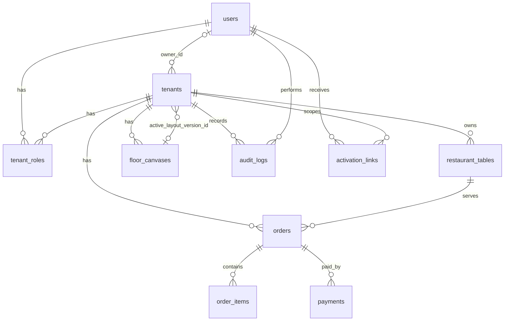

# PostgreSQL Schema (Current Code)

## Scope

This document reflects the PostgreSQL schema used by the current API codebase:

- ORM models in `app/api/core/models/`
- Alembic revisions up to `eed96e2247c3` (`2026-02-18`)

## Entity Relationship Diagram

## Tables

### `tenants`

| Column | Type | Constraints |
| --- | --- | --- |
| `id` | UUID | PK |
| `name` | VARCHAR(255) | NOT NULL |
| `slug` | VARCHAR(100) | NOT NULL, UNIQUE |
| `owner_id` | UUID | NULL, FK -> `users.id` (`ON DELETE SET NULL`) |
| `status` | `tenant_status` enum | NOT NULL, default `ACTIVE` |
| `active_layout_version_id` | UUID | NULL, FK -> `floor_canvases.id` (`ON DELETE SET NULL`) |
| `created_at` | TIMESTAMPTZ | NOT NULL, default `now()` |
| `p24_merchantid` | INTEGER | NULL |
| `p24_api` | VARCHAR(32) | NULL |
| `p24_crc` | VARCHAR(16) | NULL |

Indexes/constraints:

- PK on `id`
- Unique constraint on `slug`
- Index on `owner_id` (`ix_tenants_owner_id`)

### `users`

| Column | Type | Constraints |
| --- | --- | --- |
| `id` | UUID | PK |
| `email` | VARCHAR(255) | NOT NULL, UNIQUE |
| `password_hash` | VARCHAR(255) | NOT NULL |
| `tenant_id` | UUID | NULL, FK -> `tenants.id` (`ON DELETE SET NULL`) |
| `is_active` | BOOLEAN | NOT NULL, default `true` |
| `created_at` | TIMESTAMPTZ | NOT NULL, default `now()` |

Indexes/constraints:

- PK on `id`
- Unique constraint on `email`
- Index on `tenant_id` (`ix_users_tenant_id`)

### `tenant_roles`

| Column | Type | Constraints |
| --- | --- | --- |
| `account_id` | UUID | PK, FK -> `users.id` (`ON DELETE CASCADE`) |
| `tenant_id` | UUID | PK, FK -> `tenants.id` (`ON DELETE CASCADE`) |
| `account_type` | `account_type` enum | NOT NULL |

Indexes/constraints:

- Composite PK on (`account_id`, `tenant_id`)
- Index on `tenant_id` (`ix_tenant_roles_tenant_id`)

### `restaurant_tables`

| Column | Type | Constraints |
| --- | --- | --- |
| `id` | UUID | PK |
| `tenant_id` | UUID | NOT NULL, FK -> `tenants.id` (`ON DELETE CASCADE`) |
| `label` | VARCHAR(50) | NOT NULL |
| `capacity` | INTEGER | NOT NULL, CHECK `capacity > 0` |
| `is_active` | BOOLEAN | NOT NULL, default `true` |
| `created_at` | TIMESTAMPTZ | NOT NULL, default `now()` |

Indexes/constraints:

- Unique constraint on (`tenant_id`, `label`) (`uq_tenant_table_label`)
- Index on `tenant_id` (`idx_restaurant_tables_tenant_id`)

### `floor_canvases`

| Column | Type | Constraints |
| --- | --- | --- |
| `id` | UUID | PK |
| `tenant_id` | UUID | NOT NULL, FK -> `tenants.id` (`ON DELETE CASCADE`) |
| `name` | VARCHAR(255) | NOT NULL |
| `width` | INTEGER | NOT NULL, default `800` |
| `height` | INTEGER | NOT NULL, default `600` |
| `elements` | JSONB | NOT NULL, default `[]` |
| `version` | INTEGER | NOT NULL, default `1` |
| `created_at` | TIMESTAMPTZ | NOT NULL, default `now()` |
| `updated_at` | TIMESTAMPTZ | NOT NULL, default `now()` |

Indexes/constraints:

- Index on `tenant_id` (`idx_floor_canvases_tenant_id`)

### `orders`

| Column | Type | Constraints |
| --- | --- | --- |
| `id` | UUID | PK |
| `tenant_id` | UUID | NOT NULL, FK -> `tenants.id` (`ON DELETE CASCADE`) |
| `table_id` | UUID | NOT NULL, FK -> `restaurant_tables.id` (`ON DELETE RESTRICT`) |
| `status` | `order_status` enum | NOT NULL |
| `total_amount` | NUMERIC(10,2) | NOT NULL, CHECK `total_amount >= 0` |
| `currency` | VARCHAR(3) | NOT NULL, default `PLN` |
| `created_at` | TIMESTAMPTZ | NOT NULL, default `now()` |
| `updated_at` | TIMESTAMPTZ | NOT NULL, default `now()` |

Indexes/constraints:

- Index on (`tenant_id`, `created_at`) (`idx_orders_tenant_id_created_at`)
- Index on `table_id` (`idx_orders_table_id`)
- Index on `status` (`idx_orders_status`)

### `order_items`

| Column | Type | Constraints |
| --- | --- | --- |
| `id` | UUID | PK |
| `order_id` | UUID | NOT NULL, FK -> `orders.id` (`ON DELETE CASCADE`) |
| `product_id` | VARCHAR(255) | NOT NULL |
| `name_snapshot` | VARCHAR(255) | NOT NULL |
| `quantity` | INTEGER | NOT NULL, CHECK `quantity > 0` |
| `unit_price` | NUMERIC(10,2) | NOT NULL, CHECK `unit_price >= 0` |
| `created_at` | TIMESTAMPTZ | NOT NULL, default `now()` |

Indexes/constraints:

- Index on `order_id` (`idx_order_items_order_id`)

### `payments`

| Column | Type | Constraints |
| --- | --- | --- |
| `id` | UUID | PK |
| `order_id` | UUID | NOT NULL, FK -> `orders.id` (`ON DELETE CASCADE`) |
| `provider` | `payment_provider` enum | NOT NULL |
| `status` | `payment_status` enum | NOT NULL, default `PENDING` |
| `amount` | NUMERIC(10,2) | NOT NULL, CHECK `amount >= 0` |
| `external_reference` | VARCHAR(255) | NULL |
| `created_at` | TIMESTAMPTZ | NOT NULL, default `now()` |
| `updated_at` | TIMESTAMPTZ | NOT NULL, default `now()` |

Indexes/constraints:

- Index on `order_id` (`idx_payments_order_id`)
- Index on `status` (`idx_payments_status`)

### `audit_logs`

| Column | Type | Constraints |
| --- | --- | --- |
| `id` | UUID | PK |
| `tenant_id` | UUID | NOT NULL, FK -> `tenants.id` (`ON DELETE CASCADE`) |
| `actor_user_id` | UUID | NULL, FK -> `users.id` (`ON DELETE SET NULL`) |
| `action` | VARCHAR(100) | NOT NULL |
| `entity_type` | VARCHAR(100) | NOT NULL |
| `entity_id` | UUID | NULL |
| `audit_metadata` | JSONB | NULL |
| `created_at` | TIMESTAMPTZ | NOT NULL, default `now()` |

Indexes/constraints:

- Index on (`tenant_id`, `created_at`) (`idx_audit_logs_tenant_id_created_at`)
- Index on (`entity_type`, `entity_id`) (`idx_audit_logs_entity`)
- Index on `actor_user_id` (`idx_audit_logs_actor`)

### `activation_links`

| Column | Type | Constraints |
| --- | --- | --- |
| `id` | UUID | PK |
| `email` | VARCHAR(255) | NOT NULL |
| `user_id` | UUID | NOT NULL, FK -> `users.id` (`ON DELETE CASCADE`) |
| `tenant_id` | UUID | NOT NULL, FK -> `tenants.id` (`ON DELETE CASCADE`) |
| `created_at` | TIMESTAMPTZ | NOT NULL, default `now()` |
| `expires_at` | TIMESTAMPTZ | NOT NULL |
| `used_at` | TIMESTAMPTZ | NULL |
| `last_resend_at` | TIMESTAMPTZ | NULL |

## Enum Types

### `tenant_status`

- `ACTIVE`
- `SUSPENDED`
- `INACTIVE`

### `account_type`

- `owner`
- `waiter`
- `kitchen`
- `manager`

### `payment_provider`

- `PRZELEWY24`
- `CASH`
- `TERMINAL`
- `OTHER`

### `payment_status`

- `PENDING`
- `COMPLETED`
- `FAILED`
- `REFUNDED`

### `order_status`

- Defined in current migration/model code as a dedicated enum type used by `orders.status`
- Application enum class values are `placed`, `paid`, `cancelled`
