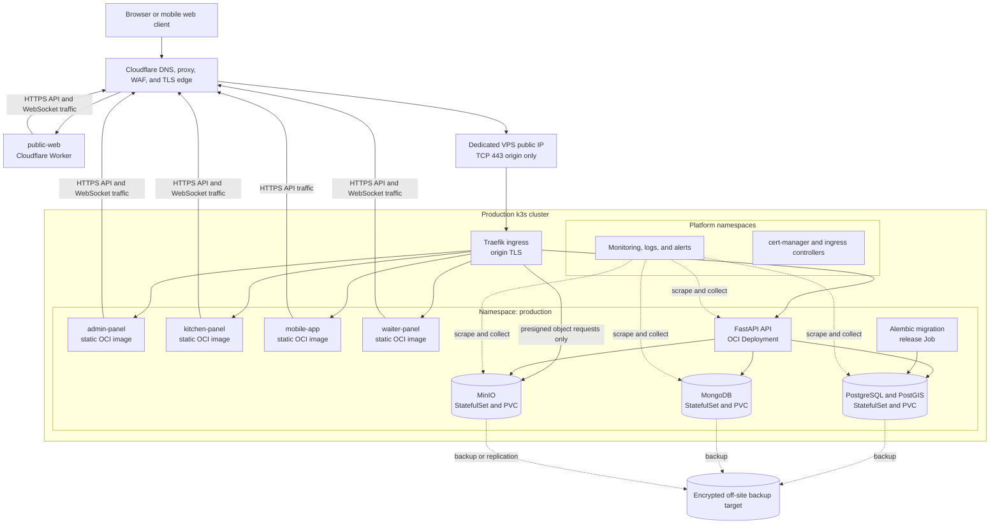

# ADR 0001: Production topology and deployment boundaries

- Status: Accepted
- Date: 2026-08-05
- Decision owners: Restorio maintainers
- Tracking issue: [#147](https://github.com/restorio-labs/restorio-fullstack/issues/147)
- Parent epic: [#141](https://github.com/restorio-labs/restorio-fullstack/issues/141)

## Context

Restorio currently deploys the API, PostgreSQL, MongoDB, MinIO, Nginx, and four static frontend bundles to one VPS with Docker Compose.
The public website is deployed separately as a Vinext application on Cloudflare Workers.
The Compose deployment builds mutable artifacts on the server, exposes data-service ports on the host, couples application startup to database migration, and has no scheduler-level rollback boundary.

The production Kubernetes roadmap needs a stable boundary before image, Helm, cluster, secret, storage, observability, and migration work begins.
This ADR defines that boundary.
It does not add Kubernetes manifests or perform the production migration.

The main drivers are:

- preserve authentication, authorization, CSRF, CORS, and tenant isolation behavior
- use declarative deployments and immutable artifacts
- keep the first k3s installation operable on small VPS infrastructure
- isolate staging failures and credentials from production
- keep stateful services private while supporting public media delivery
- make application and data rollback responsibilities explicit
- leave a clear path from a single-node installation to high availability

## Decision

Restorio will use a hybrid topology.
The public website will remain on Cloudflare Workers.
The API, authenticated Vite applications, PostgreSQL, MongoDB, and MinIO will run in k3s.
Cloudflare will remain the public DNS and HTTP edge in front of both deployment targets.

Staging and production will use separate k3s clusters on separate VPS instances.
They will not share a Kubernetes control plane, node, persistent volume, secret, or backup credential.
Each cluster will have one application namespace named after the environment: `staging` or `production`.

The initial production cluster explicitly accepts a single-node availability model.
This is a cost and operational tradeoff, not an HA claim.
Off-node backups and a tested rebuild-and-restore procedure are mandatory conditions for production cutover.

### Logical topology

The staging topology is structurally identical, except it uses the `staging` namespace, staging-only credentials, staging DNS, smaller capacity, and a separate VPS.
The same Helm chart and immutable component images must be usable in both clusters with environment-specific values.

### Deployment target matrix

| Component | Production target | Kubernetes form | Public route | State |
|---|---|---|---|---|
| `public-web` | Cloudflare Workers | None | `restorio.org`, `www.restorio.org` | Stateless |
| `admin-panel` | k3s | Independent Deployment, ClusterIP Service, immutable static-server image | `admin.restorio.org` | Stateless |
| `kitchen-panel` | k3s | Independent Deployment, ClusterIP Service, immutable static-server image | `kitchen.restorio.org` | Stateless |
| `mobile-app` | k3s | Independent Deployment, ClusterIP Service, immutable static-server image | `mobile.restorio.org` | Stateless |
| `waiter-panel` | k3s | Independent Deployment, ClusterIP Service, immutable static-server image | `waiter.restorio.org` | Stateless |
| `ui-demo` | No production deployment | None | None | Development-only |
| FastAPI API | k3s | Deployment and ClusterIP Service | `api.restorio.org` | Stateless process with stateful dependencies |
| Alembic migrations | k3s | One-shot Helm pre-upgrade Job | None | Release operation |
| PostgreSQL 17 with PostGIS | k3s for the first production phase | StatefulSet, headless Service, PVC | None | Stateful |
| MongoDB 8 | k3s for the first production phase | StatefulSet, headless Service, PVC | None | Stateful |
| MinIO object API | k3s for the first production phase | StatefulSet, ClusterIP Service, PVC | `minio.restorio.org` for object requests | Stateful |
| MinIO administrative console | k3s | ClusterIP Service only | None | Administrative |
| Ingress | k3s platform namespace | Traefik supplied and version-pinned with k3s | Origin for approved HTTP hosts | Platform |
| Certificate management | k3s platform namespace | cert-manager | None | Platform |
| Metrics, logs, and alerts | k3s observability namespace | Separate platform releases | No public route | Platform |

Each deployable application has its own image version and rollout boundary.
A frontend-only release must not roll the API or data services.
Images must be referenced by immutable digest in the resolved production release, even when a human-readable version tag is also published.

No Vinext application will run as a Node standalone process in the initial topology.
`public-web` already has a supported Workers deployment and benefits from edge execution.
The four Vite applications are static assets and do not need a persistent Node runtime.
Any future Vinext migration must prove that Workers supports the application behavior before changing this boundary.
Node standalone in k3s is a fallback for an application that requires server-side capabilities unavailable in Workers, not the default target.

### DNS, ingress, and origin boundary

Cloudflare is authoritative for public Restorio DNS and proxies all public HTTP hostnames.
The apex and `www` routes target the `public-web` Worker.
The API, authenticated frontend, and MinIO object hostnames target the production ingress origin.

The VPS firewall exposes only TCP 443 for application traffic and the minimum administration path required by operators.
Direct access to the Kubernetes API, kubelet, database ports, MinIO console, and observability interfaces from the public internet is forbidden.
Cluster administration must use a private operator path such as WireGuard, Tailscale, or a tightly allowlisted management address.
The selected mechanism belongs to cluster provisioning work, but public kubeconfig access is not allowed.

Origin TLS terminates at Traefik with certificates managed by cert-manager.
Cloudflare-to-origin TLS must use strict certificate validation.
DNS-01 validation is preferred because it does not require widening the HTTP origin boundary.
Ingress host allowlists must reject unknown hosts rather than routing them to a default application.

The edge and ingress must preserve `Host`, `X-Forwarded-For`, `X-Forwarded-Proto`, WebSocket upgrades, request size limits, and rate-limit behavior used by the API.
The API may trust proxy headers only from the ingress path.
Client IP handling must not accept spoofed forwarding headers from a direct origin connection.

Cloudflare is not an authorization boundary.
Every API request continues through the existing authentication, CSRF, authorization, and tenant guards.

### Environment and namespace boundaries

Production and staging run on separate clusters because a namespace does not isolate control-plane failure, node exhaustion, persistent disks, or cluster-admin credentials.
The application namespace names are intentionally fixed:

- production cluster: `production`
- staging cluster: `staging`

Kubernetes system, ingress, certificate, and observability components use dedicated platform namespaces and must not be installed in the application namespace.
Names are chart-controlled and consistent across environments.

Staging must use a separate registrable domain controlled by Restorio, represented in this ADR as `<staging-domain>`.
It must not use a subdomain of `restorio.org` while production authentication cookies use `Domain=.restorio.org`.
That parent-domain cookie would otherwise be sent to staging and would break the credential boundary.
Staging CORS origins, cookie settings, payment credentials, email credentials, object-storage buckets, and callback URLs must be staging-only.

Production contains one shared application deployment per component, not one namespace or deployment per tenant.
Tenant isolation remains an application and database invariant enforced by authenticated tenant context and authorization policy.
Kubernetes service accounts and network policies limit component access but do not replace tenant-scoped queries and object keys.

### Node roles and minimum VPS capacity

The first production phase uses one dedicated k3s server node that also schedules workloads.
The first staging phase uses one smaller, dedicated k3s server node that also schedules workloads.
Neither node is shared with unrelated applications.

| Environment | Initial nodes | Roles | Minimum capacity | Storage requirements |
|---|---:|---|---|---|
| Production | 1 | k3s server, worker, ingress, application, data | 8 dedicated vCPU, 16 GiB RAM, 250 GiB NVMe SSD, 1 Gbit/s network | Local encrypted filesystem, expandable volume, separate off-site backup capacity |
| Staging | 1 | k3s server, worker, ingress, application, data | 4 dedicated vCPU, 8 GiB RAM, 100 GiB SSD | No production data, separate backup path for restore tests |

Capacity is a floor, not a sizing result.
Before cutover, load tests and observed working sets must confirm CPU, memory, IOPS, and disk headroom.
At least 30 percent disk capacity and enough memory for node recovery operations must remain unallocated.
Every workload must define requests and limits, and stateful services must receive guaranteed requests based on measured usage.

The single-node production phase has no service continuity after node, disk, kernel, or VPS-provider failure.
The accepted recovery objectives are an RPO of at most one hour for transactional and object data and an RTO of at most four hours for a complete node loss.
Production cutover is blocked until automated off-site backups can meet those objectives and a staging restore drill proves them.

The HA evolution target is three k3s server nodes distributed across failure domains, with application replicas spread by topology constraints.
Stateful services must either gain independently tested replication across failure domains or move to managed services before the platform claims HA.
Adding application replicas to one node or replicating data onto one physical disk does not provide HA.

### Data-service access

PostgreSQL, MongoDB, and the MinIO console use `ClusterIP` or headless Services only.
They must not use `NodePort`, `LoadBalancer`, `hostPort`, or public DNS records.

| Caller | PostgreSQL | MongoDB | MinIO object API | MinIO console |
|---|---:|---:|---:|---:|
| FastAPI API | Allow on 5432 | Allow on 27017 | Allow on 9000 | Deny |
| Migration Job | Allow on 5432 | Deny | Deny | Deny |
| Ingress | Deny | Deny | Allow on 9000 for the public object hostname | Deny |
| Frontend pods | Deny | Deny | Deny | Deny |
| Observability collectors | Metrics endpoints only | Metrics endpoints only | Metrics endpoint only | Deny |
| Internet | Deny | Deny | Presigned object operations through ingress only | Deny |

NetworkPolicy starts with default deny for ingress and egress in the environment namespace.
Explicit rules permit DNS resolution, ingress-to-service traffic, API-to-data traffic, the migration Job, required observability collection, and narrowly defined external API calls.
PostgreSQL and MongoDB credentials are unique per environment and grant only the application permissions required by that environment.
Root and administrative credentials are reserved for controlled operations.

MinIO uses a private bucket by default.
Clients receive short-lived presigned URLs from the API and reach only the S3-compatible object endpoint through `minio.restorio.org`.
The ingress must not publish the MinIO console.
Bucket names, credentials, and encryption keys differ between staging and production.

Persistent volumes use the k3s local storage class during the single-node phase because the data is already bound to one failure domain.
PVCs are not backups.
PostgreSQL, MongoDB, MinIO data, and k3s control-plane state are backed up to encrypted storage outside the VPS and outside the VPS provider account where practical.
Restore procedures must create a fresh cluster without depending on files left on the failed node.

### Release, health, and rollback boundaries

The deployment unit is a versioned Helm release composed from independently versioned images.
Staging and production use the same chart and different values.
Production values contain image digests and configuration references, never plaintext secrets.

The API Deployment uses `/health/live` for liveness and `/health` for readiness until a dedicated readiness route exists.
Frontend containers expose a lightweight static-server health endpoint.
PostgreSQL, MongoDB, and MinIO use native health checks.
Startup probes protect slow initialization without weakening steady-state readiness.

Database migrations run once as a release Job before API rollout.
They do not run in every API container startup.
Migrations must use expand-and-contract sequencing so the previous API image remains compatible during rollout and rollback.
Destructive schema changes require a later release after the old application version is no longer a rollback target.

Application rollback selects the previous Helm revision and its existing image digests.
It must not rebuild source code.
Frontend releases, API releases, and platform releases can roll back independently when their contracts remain compatible.
Cloudflare Worker rollback selects a previously deployed `public-web` version.

Helm rollback does not reverse a data migration.
Forward repair is the default response to a successfully applied compatible migration.
A database restore is a disaster-recovery action that requires a maintenance window, explicit operator approval, and coordinated rollback of every component that wrote after the restore point.

Production migration from Compose uses a separate cutover runbook.
The current Compose deployment remains intact but read-only or stopped during the validation window and is removed only after the agreed stabilization period.
Cutover must include a fresh backup, restore verification, DNS rollback instructions, API and WebSocket smoke tests, authentication checks, tenant-isolation checks, media upload and download checks, and payment callback checks.

### Secret and security boundaries

Secrets enter the cluster through a dedicated secret-management workflow and are referenced by Kubernetes resources.
They are not committed to Git, embedded in images, printed by CI, or copied from staging to production.
The concrete secret backend is selected by the secrets implementation issue.

Every application Deployment uses its own Kubernetes ServiceAccount with token automount disabled unless Kubernetes API access is required.
Containers run as non-root with a read-only root filesystem and dropped Linux capabilities where their images permit it.
Pod Security Admission uses the restricted profile for application namespaces, with narrowly documented exceptions for third-party stateful images.

Production CORS is an explicit allowlist.
Cloudflare preview origins and localhost origins are not enabled in production.
Authentication cookies remain Secure, HttpOnly where applicable, SameSite=Lax, and scoped to the production registrable domain.
Ingress changes must not weaken CSRF validation or bypass application authorization.

## Rejected alternatives

### Keep Docker Compose as the production target

Rejected because it does not meet the roadmap requirement for declarative rollout state, scheduler health management, immutable release composition, namespace policy, and Helm rollback.
Compose remains a local development option and a temporary migration fallback only.

### Put staging and production in one k3s cluster

Rejected because namespaces do not isolate control-plane outages, cluster-admin compromise, node pressure, storage failure, or faulty platform upgrades.
The extra VPS is justified by the security and failure-domain boundary.

### Start production with a multi-node HA cluster

Rejected for the first phase because the current scale does not yet justify operating distributed k3s control-plane and stateful-service quorums without measured capacity and tested failure domains.
The initial topology states its downtime risk honestly and requires off-site recovery.
HA remains the planned evolution, not an implied property of one node.

### Run all frontends in k3s

Rejected because `public-web` already has a Workers deployment, has the broadest public reach, and does not need access to the private cluster network.
Moving it into k3s would increase origin load and couple its availability to the single production node.

### Move every frontend to Cloudflare Workers now

Rejected because the four Vite applications are currently static clients and have no proven Vinext Workers parity.
Combining a framework migration with the infrastructure migration would enlarge the rollback surface.
Their deployment target can change independently after the frontend proof-of-concept roadmap establishes compatibility.

### Run Vinext applications as Node standalone services by default

Rejected because it adds a long-running runtime, image, probes, and capacity burden without a current requirement.
It remains an explicit fallback when a future application requires server behavior not supported by the Workers target.

### Expose PostgreSQL, MongoDB, or MinIO administration publicly

Rejected because application traffic does not require public database or administrative endpoints.
Operators use the private administration path and temporary port forwarding when direct access is necessary.

### Use one Kubernetes namespace per tenant

Rejected because tenants share application deployments and databases.
Namespace-per-tenant would create operational isolation theater while leaving the actual data-isolation requirement in shared stores.
Tenant isolation continues to be enforced and tested in application authorization, queries, and object keys.

### Treat local PVC snapshots or same-node replicas as backups

Rejected because they share the node and storage failure domain.
Recoverability requires encrypted, monitored copies outside the production VPS and regular restore drills.

## Consequences

The roadmap now has stable deployment units and network boundaries.
Image publishing, Helm chart, cluster provisioning, secrets, network policies, backups, observability, and cutover work can proceed against one target.

The initial production platform still has a single-node outage risk.
This is visible, bounded by recovery objectives, and must be reassessed when traffic, availability requirements, or restore performance exceed the accepted limits.

Operating two clusters adds platform updates and monitoring work.
It also prevents staging experiments from sharing production control-plane, secret, and disk failure domains.

The hybrid frontend topology requires coordinated DNS and observability across Cloudflare and k3s.
It preserves the working public-web target while keeping the Kubernetes migration independent from future Vinext decisions.

## Implementation constraints for follow-up issues

- Provision separate staging and production VPS instances and clusters
- Keep the namespace names `staging` and `production`
- Build one immutable OCI image per self-hosted frontend and one for the API
- Pin all production images by digest in the resolved Helm release
- Run Alembic in a single release Job, not in API container startup
- Publish only ingress, API, authenticated frontend, and MinIO object routes
- Enforce default-deny network policy and the data access matrix above
- Use a separate registrable staging domain before browser authentication tests
- Validate RPO and RTO through an off-site restore drill before cutover
- Preserve the Compose deployment until the stabilization and rollback window ends
- Revisit this ADR before claiming HA or moving a frontend between Workers and k3s

## Validation

This ADR is complete when follow-up implementation reviews can answer all of the following from version-controlled configuration:

- every component matches the deployment target matrix
- staging and production use distinct clusters, namespaces, secrets, storage, and DNS
- only approved HTTP routes are publicly reachable
- data-service connectivity matches the access matrix
- every application release uses an immutable image digest
- health probes gate rollout completion
- application rollback selects existing artifacts
- backup restore tests meet the stated RPO and RTO
- authentication, CSRF, CORS, authorization, tenant isolation, media, WebSocket, and payment callback smoke tests pass
