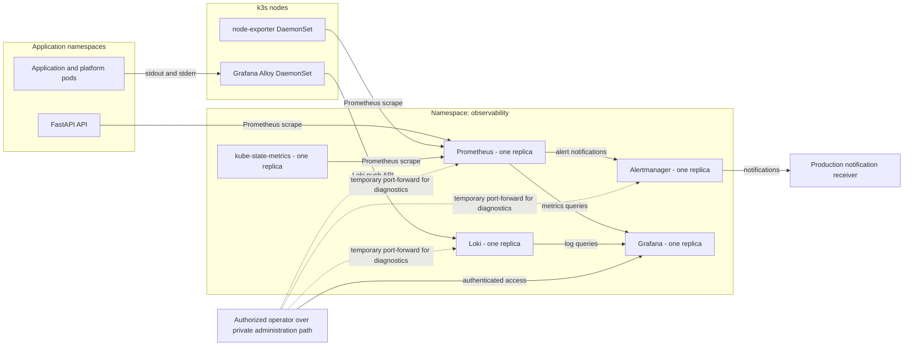

# ADR 0002: Observability architecture

- Status: Accepted
- Date: 2026-08-05
- Decision owners: Restorio maintainers
- Tracking issue: [#202](https://github.com/restorio-labs/restorio-fullstack/issues/202)
- Parent epic: [#200](https://github.com/restorio-labs/restorio-fullstack/issues/200)

## Context

ADR 0001 places the production API, authenticated applications, and stateful services on a single k3s node, with staging in a separate cluster.
That topology needs metrics, centralized logs, dashboards, and actionable alerts before production cutover.

The current API exposes health endpoints, returns request IDs and timing headers, writes general text logs to standard output, and writes audit events as JSON to standard output.
It does not expose Prometheus metrics or send logs to centralized storage.
The repository does not yet contain a Kubernetes observability deployment.

The initial architecture must fit the minimum production capacity in ADR 0001 without implying high availability.
It must preserve storage headroom for the application databases, avoid unbounded telemetry cardinality, keep administrative interfaces private, and allow an observability failure without stopping application traffic.
Staging and production must remain separate failure and credential domains.

## Decision

Each k3s cluster will run its own observability stack in a dedicated `observability` namespace.
The initial stack consists of Prometheus, Grafana, Alertmanager, Grafana Loki, Grafana Alloy, kube-state-metrics, and node-exporter.
The stack will be installed as version-pinned platform releases with environment-specific values.
Dashboards, alert rules, data-source provisioning, and collector configuration will be stored in version control.

The initial topology deliberately uses one replica for Prometheus, Grafana, Alertmanager, Loki, and kube-state-metrics.
Alloy and node-exporter run as DaemonSets so that each k3s node is covered when nodes are added.
Single replicas are an explicit availability tradeoff and not an HA claim.

Prometheus will use exactly one replica and will not have a HorizontalPodAutoscaler.
Scaling Prometheus vertically requires measured resource or query pressure and a planned restart or rollout.
Horizontal scaling requires a different storage and query architecture and belongs to the future HA path.

### Logical topology

The arrows show logical traffic rather than public routes.
Prometheus, Alertmanager, Loki, and their administrative APIs remain ClusterIP-only.
Application processes do not depend on Loki, Prometheus, Grafana, or Alertmanager to serve requests.

### Component responsibilities

| Component | Initial form | Responsibility | Persistent state |
|---|---|---|---|
| Prometheus | One StatefulSet replica | Discover and scrape application, Kubernetes, node, and observability targets; evaluate recording and alert rules; serve metric queries to Grafana | Local TSDB on a PVC |
| Grafana | One Deployment replica | Query Prometheus and Loki; present provisioned dashboards; provide the primary protected operator interface | Configuration in Git and a small PVC for the Grafana database |
| Alertmanager | One StatefulSet replica | Group, deduplicate, inhibit, and route alerts to environment-specific receivers | Small PVC for notification and silence state |
| Loki | One StatefulSet replica in monolithic mode | Ingest, retain, and query cluster logs | Filesystem storage on a PVC |
| Alloy | DaemonSet | Discover pod log files, parse and enrich records, and forward them directly to Loki with bounded buffering and retries | Ephemeral bounded buffer only |
| kube-state-metrics | One Deployment replica | Expose Kubernetes object state such as pod, workload, Job, and PVC status | None |
| node-exporter | DaemonSet | Expose node CPU, memory, filesystem, disk, and network metrics | None |
| Application metrics | FastAPI endpoint and instrumented code | Expose request, dependency, WebSocket, and domain-operation signals in Prometheus format | None |
| Structured application logs | JSON records on standard output and standard error | Record application, audit, and error events for Alloy collection | None in the application container |

Prometheus scrapes itself and every stack component that exposes metrics.
Alert rules must cover observability target loss, failed notification delivery, ingestion failures, and storage pressure so that failures of the monitoring stack are visible when a viable signal path remains.

### Metrics collection and cardinality

The FastAPI API will expose a cluster-internal Prometheus endpoint.
Ingress and NetworkPolicy will not publish that endpoint to the internet.
Prometheus will discover it through Kubernetes-native ServiceMonitor or PodMonitor resources.

Initial application metrics will cover:

- HTTP request rate, error rate, and duration by method, normalized route, and status class
- active HTTP requests and WebSocket connections
- dependency request duration and failures for PostgreSQL, MongoDB, Redis, MinIO, email, and payment integrations where practical
- authentication failures, authorization denials, rate-limit decisions, payment callbacks, and order-processing outcomes
- process and Python runtime metrics supplied by the selected instrumentation library

Metric names and labels form a compatibility and capacity boundary.
Labels may contain bounded dimensions such as service, environment, method, normalized route, status class, operation, and dependency.
Metrics must not label observations with tenant IDs, user IDs, order IDs, payment IDs, email addresses, request IDs, raw URLs, exception messages, or other unbounded values.
Sensitive or tenant-specific detail belongs in access-controlled logs, not metric labels.

Prometheus will initially use a 30-second scrape interval and a 30-second rule-evaluation interval.
An individual target may use a shorter interval only when an alert or SLO requires it and the storage impact is measured.

### Structured logging and log labels

Containers write logs to standard output or standard error and do not manage log files.
Application logs will use one JSON object per line with a stable schema.
The initial schema includes timestamp, severity, service, environment, version, message, event name, request ID, route, duration, and exception details when applicable.
Tenant ID, actor ID, and object ID may appear as JSON fields when they are necessary for authorized operational or audit investigation, but they must not become Loki index labels.

Secrets, authorization headers, session cookies, access tokens, refresh tokens, password material, payment credentials, complete payment payloads, and unnecessary personal data must never be logged.
Request and response bodies are not logged by default.
Logging and collection errors must not fail an application request.

Alloy runs on every node, discovers Kubernetes pod logs, parses valid JSON, preserves unparsed lines with a parse-error field, and adds bounded Kubernetes metadata.
The initial Loki label set is limited to environment, namespace, service, container, severity, and stream.
Pod name, request ID, tenant ID, user ID, trace ID, raw route, and other high-cardinality values remain queryable fields rather than labels.
The deployment must define label-drop rules so that Kubernetes discovery metadata is not promoted indiscriminately.

Alloy forwards logs directly to Loki.
Kafka, Redpanda, RabbitMQ, Redis, and database-backed queues are explicitly excluded from the logging pipeline.
Adding a broker would increase failure modes and resource use without a current durability or fan-out requirement.
Alloy uses bounded memory or disk buffering and retries with backoff during a temporary Loki outage, then drops data according to an explicit limit rather than exhausting the node.

### Retention and storage

Retention has both time and size boundaries so a telemetry surge cannot consume the node.
The initial production values are capacity starting points and must be adjusted from measured ingestion while preserving the disk headroom required by ADR 0001.

| Data | Production retention | Staging retention | Initial PVC | Full-volume behavior |
|---|---:|---:|---:|---|
| Prometheus metrics | 15 days and at most 25 GiB of TSDB blocks | 7 days and at most 10 GiB | 30 GiB production, 15 GiB staging | Delete oldest blocks within configured retention and alert before the PVC reaches 80 percent |
| General Loki logs | 14 days | 7 days | 35 GiB production, 15 GiB staging | Enforce compactor retention and reject or delete expired data; alert before the PVC reaches 80 percent |
| Security and audit log stream | 30 days | 14 days | Shared Loki PVC and a stream-specific retention rule | Apply the same storage-pressure alerts and preserve bounded retention |
| Grafana database | Configuration lifetime | Configuration lifetime | 2 GiB | Alert on PVC pressure; recover provisioned assets from Git |
| Alertmanager state | 120 hours for notification log and silences as configured | 120 hours | 1 GiB | Alert on PVC pressure; configuration remains recoverable from Git |

The Prometheus PVC size exceeds its TSDB size limit to leave compaction and write headroom.
The Loki PVC must leave compaction and temporary-file headroom beyond expected retained chunks.
The cluster must alert at 70 percent and 80 percent PVC usage, with a critical alert based on predicted exhaustion time.
Operators must reduce retention or increase capacity before storage pressure threatens the node.

### Resource requests and limits

The following values are initial production reservations for one node, not permanent sizing guarantees.
Staging may use smaller limits but must preserve the same topology and behavior.

| Component | CPU request | CPU limit | Memory request | Memory limit |
|---|---:|---:|---:|---:|
| Prometheus | 300m | 1000m | 768 MiB | 2 GiB |
| Loki | 200m | 1000m | 512 MiB | 1536 MiB |
| Grafana | 100m | 500m | 256 MiB | 512 MiB |
| Alertmanager | 50m | 200m | 128 MiB | 256 MiB |
| Alloy, per node | 100m | 500m | 128 MiB | 512 MiB |
| kube-state-metrics | 50m | 200m | 128 MiB | 256 MiB |
| node-exporter, per node | 25m | 100m | 64 MiB | 128 MiB |

The initial production stack reserves approximately 825m CPU and 1984 MiB memory on a one-node cluster.
Implementation must verify the exact total after chart defaults and sidecars are rendered.
The values must be load-tested with expected metric series, log volume, dashboard queries, and compaction work before production cutover.
Any increase must be reconciled with the 30 percent disk headroom and node-recovery memory headroom required by ADR 0001.

Prometheus must not receive an HPA.
Loki, Grafana, and Alertmanager also remain fixed at one replica in this phase.
Alloy and node-exporter scale only by following the node count through their DaemonSets.

### Dashboards and alerts

Grafana data sources, dashboards, and folders will be provisioned from version-controlled configuration.
Manual production dashboard edits are temporary and must be exported to the repository or discarded.
Dashboards must support environment and service filtering without using tenant IDs as data-source labels.

Prometheus owns alert-rule evaluation and sends alerts to Alertmanager.
Alertmanager owns grouping, inhibition, deduplication, routing, and receiver credentials.
Every paging alert must identify the environment, affected service, severity, summary, and a version-controlled runbook URL.
Alert rules should describe user-visible symptoms before internal causes where possible and must include a sustained `for` interval to avoid paging on transient noise.

Production routes actionable notifications to the selected on-call receivers.
Staging uses separate receivers and must not page the production on-call path by default.
Notification credentials are Kubernetes Secrets and are never stored in Helm values committed to the repository.

### Access control and network boundaries

Observability interfaces have no public Ingress, NodePort, LoadBalancer Service, or public DNS record.
Prometheus, Loki, Alertmanager, kube-state-metrics, and node-exporter are reachable only inside the cluster, subject to default-deny NetworkPolicy and explicit scrape, query, and ingestion rules.

Grafana is the normal human query interface.
Operators reach it through the private administration path required by ADR 0001 and must authenticate with individual identities.
Anonymous access and shared routine administrator accounts are forbidden.
Grafana roles grant read-only dashboard access by default and reserve data-source, user, and dashboard administration for platform maintainers.
Authentication integration is selected during deployment, but it must support revocation and environment-specific authorization.

Direct Prometheus, Loki, and Alertmanager access is limited to platform maintainers using temporary authenticated port-forwarding or an equivalently private administrative mechanism.
Kubernetes RBAC restricts port-forward and Secret access.
Service accounts receive only the discovery, scrape, query, or write permissions required by their component.

Telemetry is operationally multi-tenant but not a customer-facing analytics surface.
Restaurant users do not receive direct Grafana, Prometheus, or Loki access in this phase.
Access to logs that contain tenant or actor identifiers is restricted to authorized maintainers and audited through the selected cluster and identity-provider controls.

### Environment separation

Staging and production run independent copies of the complete stack in their separate clusters.
They do not share Prometheus storage, Loki storage, Grafana databases, Alertmanager state, credentials, receivers, PVCs, or service accounts.
Every metric and log record carries a bounded environment label to prevent ambiguity inside its cluster and in any future remote storage.

The same version-pinned charts and repository-managed dashboards, rules, and collector configuration are promoted between environments.
Environment-specific values define retention, storage size, resource limits, URLs, and notification receivers.
Staging validates chart upgrades, rule changes, dashboard changes, restore procedures, and telemetry volume before production rollout.

### Backup and recovery expectations

Observability configuration is durable source code.
Helm values without secrets, dashboards, alert rules, recording rules, data-source provisioning, and Alloy configuration are backed up by the repository and must be reproducible in a fresh cluster.
Secrets follow the platform secret-management and recovery process defined by the production infrastructure work.

Prometheus metrics are disposable operational data in the initial phase.
The local Prometheus TSDB is not copied to the general off-site backup because crash-consistent TSDB recovery and the transfer cost are not justified for a 15-day window.
After a node loss, Prometheus is redeployed from configuration and starts with an empty TSDB.
This data-loss boundary must be included in incident and SLO reviews.

Loki logs are not treated as the authoritative audit ledger.
The initial Loki filesystem may be included in encrypted off-node volume backups only if the backup system can take an application-consistent snapshot without blocking ingestion and can meet the security controls for the log content.
Until that capability is proven, a node loss may lose retained Loki data.
Any legal or compliance requirement for durable audit records must be implemented as a separate append-only audit archive rather than extending Loki retention by assumption.

Grafana's database and Alertmanager state are convenient operational state rather than the source of configuration truth.
They may be included in the encrypted platform backup, but recovery must also work by redeploying provisioned configuration from Git.
Restore drills must verify that data sources, dashboards, rules, receivers, and collector pipelines become healthy in a fresh staging cluster.

### Failure behavior

If Prometheus is unavailable, applications continue serving and only metrics collection and alert evaluation are interrupted.
If Loki is unavailable, applications continue writing to their container streams while Alloy retries within its bounded buffer.
If Grafana is unavailable, collection, storage, and alert evaluation continue.
If Alertmanager is unavailable, Prometheus continues evaluating alerts but notifications are delayed or lost until delivery resumes.

Readiness and liveness probes for application workloads must not depend on any observability component.
NetworkPolicy must allow telemetry flow without giving observability components unrestricted access to application or data-service ports.
Resource limits, storage alerts, and log-rate controls prevent the observability stack from exhausting the node during an application failure or logging storm.

## Future high-availability path

High availability is not implemented by this decision.
It becomes justified when availability objectives cannot tolerate the documented single-node and single-replica gaps, when ingestion exceeds safe vertical capacity, or when longer retention requires object storage.

The future path is:

1. Add at least three k3s server nodes across real failure domains as required by ADR 0001.
2. Move Prometheus long-term blocks to an object-storage architecture such as Thanos, or adopt a compatible distributed metrics backend, before adding replicas that would otherwise produce duplicate independent series.
3. Move Loki chunks and indexes to object storage and adopt simple-scalable or distributed mode with replicated write and read paths.
4. Run an odd-sized Alertmanager cluster across failure domains and configure Prometheus to notify every Alertmanager peer.
5. Run multiple Grafana replicas behind a private endpoint with an external shared database and repository-provisioned configuration.
6. Keep Alloy and node-exporter as DaemonSets and add topology constraints and disruption budgets to replicated components.
7. Evaluate remote, cross-cluster querying without weakening the staging and production credential boundary.

Distributed tracing, continuous profiling, real-user monitoring, and long-term business analytics are separate decisions.
OpenTelemetry may later provide trace correlation, but trace IDs can be added as non-indexed log fields without selecting a tracing backend now.

## Rejected alternatives

### Add Kafka to the logging pipeline

Rejected because the initial pipeline has one collector and one log backend.
Kafka would add storage, replication, schema, monitoring, upgrade, and recovery work without a concrete logging requirement that Alloy buffering and Loki ingestion cannot meet.
Kafka-compatible streaming may still be evaluated for application events under its own ADR, but it is not part of log transport.

### Use a hosted observability platform immediately

Rejected for the initial phase because the roadmap requires the named in-cluster stack and current ingestion volume is not measured.
The design preserves standard Prometheus and Loki interfaces so a later cost, residency, and reliability review can select remote storage or a managed service.

### Start with a distributed or highly available stack

Rejected because the initial k3s topology has one node per environment.
Multiple replicas on one node would not survive the node failure and would consume resources needed by the application and data services.

### Expose each observability interface through public ingress

Rejected because these APIs reveal infrastructure and potentially tenant-sensitive operational data.
The private operator path and Grafana provide the required human access without enlarging the public attack surface.

### Put tenant and request identifiers in metric or Loki labels

Rejected because unbounded labels create series and index cardinality that can exhaust memory, storage, and query capacity.
Identifiers remain structured log fields that authorized operators can filter at query time.

### Back up every Prometheus block by default

Rejected because short-retention metrics are reproducible and are not transactional records.
Configuration recovery and application-data backups take priority on the initial single-node platform.
Long-term metrics durability belongs to the future object-storage architecture.

## Consequences

Restorio gains one coherent path for cluster metrics, centralized logs, dashboards, and operational alerts.
Follow-up implementation can select version-pinned charts and instrumentation against explicit topology, capacity, retention, security, and failure boundaries.

The stack consumes meaningful CPU, memory, and local disk on the same node as production workloads.
Retention and label controls are therefore correctness requirements, not optional optimizations.
Initial sizing must be validated under load and reviewed after real production ingestion is available.

The initial stack loses monitoring and some retained telemetry after a node failure.
That limitation matches the single-node phase and is documented rather than hidden behind same-node replicas.
Application data remains governed by the stricter backup objectives in ADR 0001.

## Implementation constraints for follow-up issues

- Deploy each environment's stack in its own `observability` namespace
- Pin chart and image versions and promote the same configuration through staging
- Run exactly one Prometheus replica with no HPA
- Provision the documented PVCs, retention limits, requests, and limits
- Store dashboards, rules, data sources, and collector configuration in version control
- Keep all component APIs off the public internet
- Enforce default-deny NetworkPolicy with explicit scrape, query, and ingestion flows
- Send structured container logs directly from Alloy to Loki without Kafka or another broker
- Reject high-cardinality metric and Loki labels during review and automated validation
- Keep application probes and request paths independent from the observability stack
- Configure production and staging with separate credentials and notification receivers
- Validate storage pressure, collector backpressure, alert delivery, and fresh-cluster recovery before production cutover

## Validation

This ADR is complete when follow-up implementation reviews can answer all of the following from version-controlled configuration:

- every named component has the responsibility and deployment form defined above
- Prometheus has one replica, persistent storage, bounded retention, and no HPA
- Loki has bounded retention and receives logs directly from Alloy
- no Kafka-compatible or queueing system appears in the logging path
- every component has explicit requests and limits
- staging and production have independent stacks, credentials, storage, and receivers
- no observability administrative interface is publicly routable
- dashboards, rules, and data sources can be recreated from the repository
- application metrics and Loki labels pass cardinality and sensitive-data checks
- observability failures do not make application workloads unready
- storage-pressure and notification-delivery tests produce actionable alerts
- the future HA path is documented but no implementation claims HA in the single-node phase