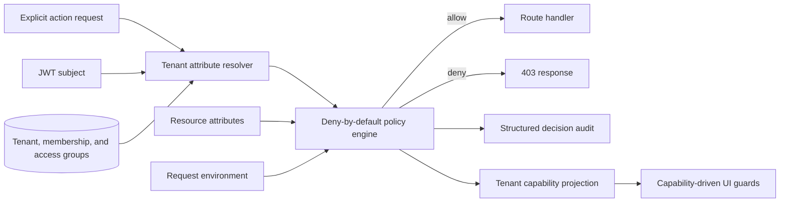

# Attribute-based authorization

Restorio uses a tenant-scoped, deny-by-default attribute-based access control system.

The access token proves identity only.
It does not carry authoritative tenant memberships, roles, or capabilities.
Every tenant decision loads current attributes from PostgreSQL for the tenant named by the request.

## Decision model



An authorization request contains:

- a subject with an account ID, tenant-scoped membership attributes, and future custom attributes
- one explicit action from `core.authorization.actions.AuthorizationAction`
- a resource with its type, tenant boundary, lifecycle status, ID, and future custom attributes
- an environment with timestamp, HTTP method, path, client IP, and future custom attributes

Unknown or ungranted actions are denied.
Missing memberships are denied.
Cross-tenant subject and resource combinations are denied before capability evaluation.
Operational actions against suspended or inactive tenants are denied.

## Policy baseline

The current role value is a transitional subject attribute that preserves existing product behavior.
It is not read from the token and it is not a route guard.
The policy can add ownership, location, shift, device posture, order assignment, payment amount, or time-window attributes without changing route contracts.

| Subject attribute | Baseline capabilities |
| --- | --- |
| owner | Tenant lifecycle, payment credentials, staff management, configuration, and all member operations |
| manager | Profile, mobile, menu, and kitchen configuration plus all member operations |
| waiter | Waiter application access, tenant and menu reads, floor reads, waiter order lifecycle, table sessions, and payment initiation |
| kitchen | Kitchen application access, tenant and menu reads, item availability, kitchen order transitions and refunds, and kitchen configuration reads |

The exact action sets live in `app/api/core/authorization/policies.py`.
This file is the reviewable policy source of truth.

## Tenant access groups

Owners can create reusable access groups in the Staff page and assign any number of groups to an employee.
Each group adds capabilities to the employee's baseline membership for that tenant.
Assignments take effect on the next API request because capabilities are resolved from PostgreSQL rather than cached in the access token.

Custom groups can only contain actions from `DELEGABLE_ACTIONS`.
Tenant ownership, admin-panel entry, payment credentials, staff creation or deletion, and access-group management are non-delegable.
The policy engine enforces this boundary again during every decision, so invalid stored data cannot manufacture owner authority.

The management API is available under:

```text
GET    /api/v1/tenants/{tenant_public_id}/access-groups
POST   /api/v1/tenants/{tenant_public_id}/access-groups
PUT    /api/v1/tenants/{tenant_public_id}/access-groups/{group_id}
DELETE /api/v1/tenants/{tenant_public_id}/access-groups/{group_id}
PUT    /api/v1/tenants/{tenant_public_id}/access-groups/{group_id}/members/{account_id}
DELETE /api/v1/tenants/{tenant_public_id}/access-groups/{group_id}/members/{account_id}
```

Group names are unique per tenant without regard to letter case.
Assignments require a current membership in the same tenant, and owner memberships cannot receive custom groups.

## Backend route contract

Routes declare the action they need through a typed dependency such as `OrderReadTenantId`, `MenuWriteTenantId`, or `PaymentConfigWriteTenantId`.
The dependency returns the verified internal tenant UUID only after a successful policy decision.

For resource-level rules, load the resource before mutation and call the engine with resource attributes such as `created_by`, `assigned_to`, `classification`, or `amount`.
Do not add a role check to the handler.
Do not put authority claims into a JWT.

## Capability projection

Authenticated clients can call:

```text
GET /api/v1/tenants/{tenant_public_id}/capabilities
```

The response contains the tenant public ID, policy version, and actions currently granted by the full policy.
The projection respects tenant lifecycle state and other evaluated attributes.

Frontend applications use `CapabilityGuard` and `useCan` from `@restorio/auth`.
Frontend capability checks control presentation only.
The API remains the authorization authority.

## Auditing

Every tenant decision emits an `authorization_decision` event with:

- account ID
- tenant public ID
- action
- allow or deny result
- stable policy ID
- decision reason
- request metadata supplied by the structured audit logger

Sensitive credentials and request bodies are not included.

## Adding an action

1. Add the action to `AuthorizationAction`.
2. Add it to the appropriate policy capability set or implement an attribute rule in the engine.
3. Add a typed dependency alias in `core.authorization.dependencies`.
4. Declare that dependency on every route that performs the operation.
5. Add allow, deny, tenant-boundary, and lifecycle tests.
6. Add the action to the shared frontend type projection only when a UI needs it.
7. Guard relevant UI surfaces with `CapabilityGuard` or `useCan`.

The policy engine and capability endpoint must remain deterministic and free of network calls.
Attribute resolution belongs at the boundary before evaluation.
